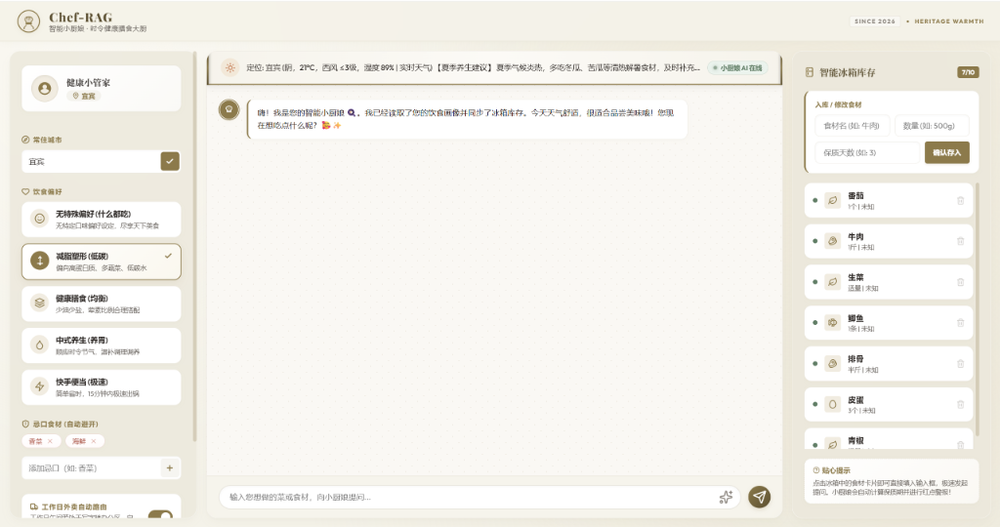

# Chef-RAG 智能小厨娘：您的时令健康膳食大厨 Agent 🍳✨

`Chef-RAG` 是一款基于 **LangGraph 状态图** 独立构建的 `ReAct` 架构智能膳食决策与问答系统。它不仅能回答“今天吃什么”或“某道菜怎么做”，还能智能感知当前常住城市的天气与应季时令，读取您的口味忌口画像，结合冰箱现有食材进行食谱混合检索推荐，并在您确认做菜后对冰箱库存进行**物理扣除**与自动沉淀用户饮食画像，实现了大模型决策与物理状态的深度闭环。



---

## 🎨 项目视觉亮点 (Heritage Warmth 拟物化 Dashboard)

前端使用纯原生 HTML5/CSS3/JavaScript 编写，基于 **Heritage Warmth（传承暖意）** 拟物化艺术风格重构，彻底告别干瘪的后台管理既视感：
* **复古纸张氛围**：body背景使用象牙白到日照暖金的漫反射渐变，营造出精装纸质食谱画册的呼吸质感。
* **古风养生卷轴**：中栏顶部常驻带有深色木质轴头与投影的“皮质卷轴天气时令幅”，呈现古代膳食调养的仪式感。
* **法式拟物餐单卡**：大厨推荐的食谱以精美古铜金蕾丝花边、内联手绘餐盘 SVG 水印的“法式手写复古餐牌”卡片呈现，质感极高。
* **货架式智能冰箱**：冰箱列表项设计为“白色陶瓷抽屉货架”，对即将过期（≤ 2天）的食材左侧的红点警报带有缓缓闪烁的呼吸柔光。食材会自动根据关键字匹配并自动映射出对应的矢量图标（如肉类 🥩、蔬菜 🥦、海鲜 🐟 等）。
* **拟真流式打字输出**：大厨的所有回答均以 12ms 的自适应打字流逐字吐出，尾部带有一颗温润闪烁的古铜金微光游标（`▮`），极富人机交互生命力。

---

## ⚙️ 核心技术架构与亮点

1. **ReAct 智能体与 LangGraph 双节点状态图**：
   采用极简而高凝聚的双节点拓扑（`agent_node` 决策交互节点 与 `memory_node` 口味画像记忆节点）。大厨作为唯一智能中枢，自发调用 7 大工具，并在对话退出或重置时一键归档记忆，更新至本地 `user_profile.json`。
2. **混合检索与归一化加权融合**：
   使用本地向量数据库（ChromaDB）的高精语义检索 + 本地 BM25 词频检索，在 Python 列表中配合 **Min-Max 归一化线性加权融合 (Weighted Linear Fusion) 算法** 进行计算，并引入了时令加权 (Season Boosting) 与标题精准匹配加权 (Title Boosting) 机制，解决模糊需求、错别字及小样本库下的召回排名倒置痛点。
3. **冰箱物理联动与下厨条件智能识别**：
   * **物理扣除**：大厨 Agent 在收到“确认做某菜”或点击“开始烹饪”时，将触发底层 `deduct_fridge_ingredients` 工具，对冰箱中对应的食材库存进行真实物理扣减。
   * **无下厨条件兼容**：自动识别用户在“公司”、“不开火”或画像中“外卖（Delivery）”的意图，解除冰箱食材强过滤限制，自动分流推荐。
4. **四级高可用高精天气链**：
   国内高精度自适应天气定位感知链（高德地图天气 -> 心知天气 -> 和风天气 -> wttr.in 递归重试），并具备 commercial/free 域名防封切换机制。
5. **极其强健的秒级降级防御（高可用容灾）**：
   当遇到大模型 API 封锁/超时或本地向量库 DLL 损坏等极端状态，系统可在 1.0 秒内无感退化至**纯本地规则匹配/BM25 检索与静态四季养生贴士推荐模式**，保证服务 100% 不掉线。

---

## 📂 项目结构说明

```text
chefrag/
├─ src/
│  ├─ agent/
│  │  └─ graph.py           # LangGraph 决策核心（agent_node + memory_node）
│  ├─ rag/
│  │  └─ vector_store.py    # 混合检索底座（ChromaDB + BM25 归一化混合加权与 Boosting）
│  └─ tools/
│     ├─ agent_tools.py     # 解耦后的 7 大 LangChain @tool 工具插件
│     ├─ context_tool.py    # 气象感知与时令养生分析（四级高可用天气链）
│     ├─ inventory_tool.py  # 智能冰箱库存 CRUD 物理扣减类
│     └─ user_profile_tool.py # 用户口味偏好画像读写工具类
├─ static/
│  ├─ index.html            # Web 仪表盘前端 HTML 结构 (Inline SVG 静态图标)
│  ├─ index.css             # 拟物化纸卷轴天气栏、法式餐单卡样式
│  └─ index.js              # 打字机流式输出、API_BASE file:协议自适应定位路由
├─ tests/
│  └─ test_flow.py          # 包含 6 大核心场景（包括无下厨限制、降级）的集成测试脚本
├─ requirements.txt         # 完备的依赖说明文件
├─ .env.example             # 环境变量配置模板
├─ web_server.py            # FastAPI Web 服务端入口与静态资源挂载托管
├─ tui_app.py               # 终端控制台命令行 TUI 交互程序
└─ user_profile.json        # 用户长期画像数据持久化文件
```

---

## 🚀 快速开始

### 1. 环境准备与依赖安装
克隆本项目到本地后，在 Python 虚拟环境中一键安装依赖：
```bash
pip install -r requirements.txt
```

### 2. 配置文件设置
复制并重命名 `.env.example` 为 `.env`：
```bash
cp .env.example .env
```
在 `.env` 中配置您的大模型 API 密钥：
```env
OPENAI_API_KEY=your-api-key-here
OPENAI_BASE_URL=https://api.openai.com/v1 # 或您的代理转发地址
RECIPES_PATH=data/recipe
```
*(注：如果未检测到 `OPENAI_API_KEY` 或大模型连接失败，系统启动时将自动检测并激活**本地安全降级模式**运行，功能不受影响)*

### 3. 双模式运行

#### 💻 网页端 Dashboard 运行（推荐）
启动本地 FastAPI 后端：
```bash
python web_server.py
```
控制台将输出服务启动成功的提示。此时：
* **打开方式 A**：在浏览器中直接访问托管地址：`http://127.0.0.1:8000`。
* **打开方式 B**：直接在本地双击 `static/index.html` 网页文件。前端内置了 `API_BASE` 容灾，将自动连上 `8000` 后端服务，享受完整的跨域对话交互。

#### 🐚 命令行终端 TUI 运行
如果您偏爱极客风的命令行对话，可以运行：
```bash
python tui_app.py
```
支持在控制台进行实时饮食管理、冰箱查看及偏好配置。在退出对话或输入 `/exit` 时，Agent 会自动在后台将本轮会话内容提炼成偏好记忆并写回配置。
